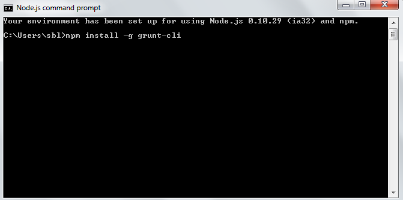
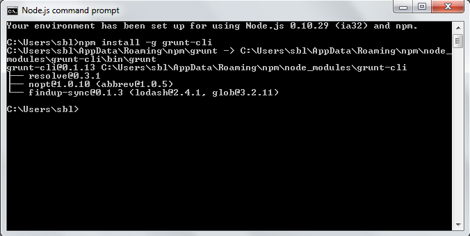
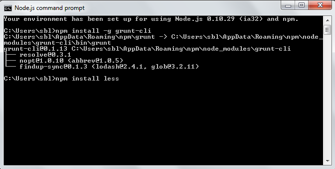
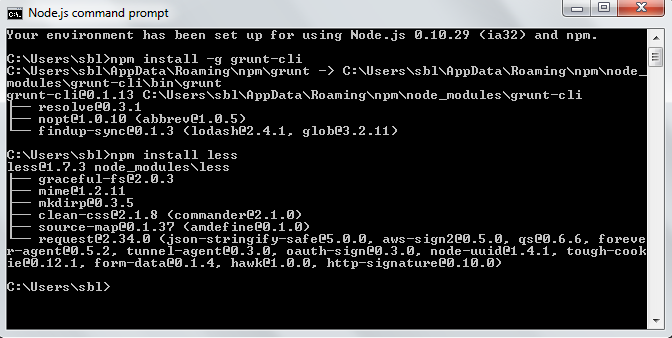
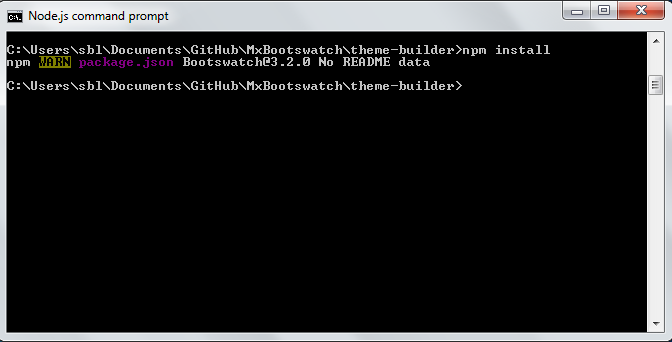

MxBootswatch
==========

MxBootswatch is a collection of free themes for Mendix using the [Bootstrap](http://getbootstrap.com/) framework. These themes are based on the themes provided by Bootswatch. Check it out at [bootswatch.com](http://bootswatch.com).

Usage
-----
Download the `bootstrap.min.css` file associated with a theme and replace Bootstrap's default stylesheet.

Installation
-----
To use the theme builder you must have a number of components installed before being able to use the builder.

You can of course use the complied themes without the theme builder, but the theme builder gives you the flexibility of being able to change a couple of variables and build a new great looking theme.

To get started you will need to install Node.js. Node.js can be downloaded from [here](http://nodejs.org/) and you can install it on windows, mac or linux.

Once Nodejs is installed open up in the node.js command prompt on windows or open up the terminal on mac.

The first thing you will need to do is install Grunt. Grunt is a javascript task runner, which will allow you to build the correct zipped structure for your themes.

In the terminal type the following command:
npm install -g grunt-cli

The next thing you will to install is the less compiler.
To do this type the following:
npm install less

We now have all the necessary components installed to build your themes.

We can now install our theme builder. Navigate to the theme-builder folder and type the command:
npm install

Customization
------
MxBootswatch is open source and you’re welcome to modify the themes.

Each theme consists of two LESS files. `variables.less`, which is included by default in Bootstrap, allows you to customize [these settings](http://getbootstrap.com/customize/#less-variables). `bootswatch.less` introduces more extensive structural changes.

Check out the [Help page](http://bootswatch.com/help/) for more details on building your own theme.

API
-----

A simple API is available for integrating your platform with Mendix and Bootswatch.

Included in this project is a Grunt.js file which enables you to easily combile your less files and create the appropriate zip files for you themes.

To build a theme using grunt simply type:
`grunt swatch : themename`

Alternatively you can build all the themes using the command swatch.

The swatch objects are returned in an array called `themes`, each one with the following properties:  `name`, `description`, `preview`, `thumbnail`, `css`, `cssMin`, `less`, and `lessVariables`.

More info at http://bootswatch.com/help/#api

Author
------
Simon Black
+ http://mendix.com

Thomas Park

+ http://github.com/thomaspark
+ http://thomaspark.me

Thanks
------
[Mark Otto](http://github.com/markdotto) and [Jacob Thornton](http://github.com/fat) for [Bootstrap](https://github.com/twitter/bootstrap).

[Jenil Gogari](http://www.jgog.in/) for his contributions to the Flatly theme.

[James Taylor](http://github.com/jostylr) for [cors-lite](https://github.com/jostylr/cors-lite).

Copyright and License
----
Copyright 2014 Simon Black
Copyright 2014 Thomas Park

Code released under the MIT License.
